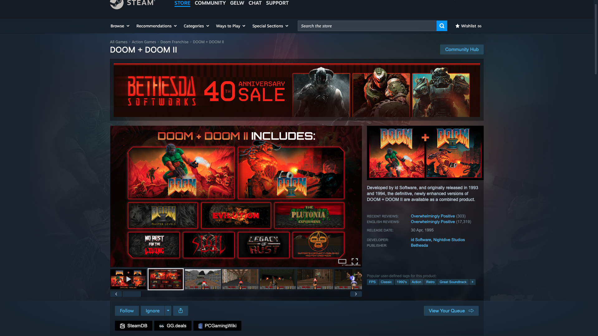
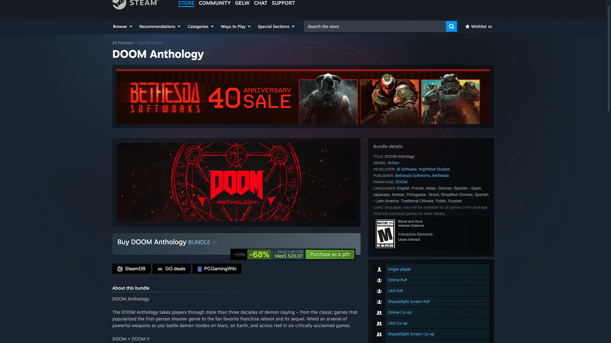
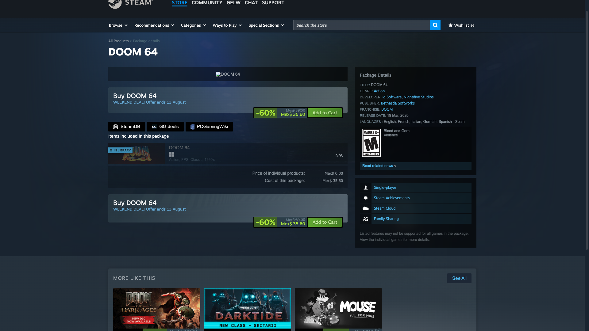

# Steam to SteamDB Button

Tampermonkey userscript that adds SteamDB, GG.deals and PCGamingWiki buttons to Steam pages. / Userscript de Tampermonkey que añade botones a SteamDB, GG.deals y PCGamingWiki en las páginas de Steam.

*Game page (`/app/`): the buttons get their own row below Steam's action bar, instead of crowding Follow / Ignore / Wishlist. / Página de juego (`/app/`): los botones reciben su propia fila bajo la barra de acciones de Steam, en vez de apretujarse con Follow / Ignore / Wishlist.*

*Bundles (`/bundle/`) and packages (`/sub/`): the buttons go into the purchase area, right under the price. / Bundles (`/bundle/`) y paquetes (`/sub/`): los botones entran en la zona de compra, justo bajo el precio.*

## English

### What it does

Adds three buttons to Steam **game** (`/app/`), **bundle** (`/bundle/`) and **package** (`/sub/`) pages:

- **[SteamDB](https://steamdb.info/)** — price history, technical data, package contents and change tracking. It links to **the matching page for that exact product**, not to a search: the type and the numeric id both come from the URL you are already on, so an `/app/` opens `steamdb.info/app/…` and a `/sub/` opens `steamdb.info/sub/…`.
- **[GG.deals](https://gg.deals/)** — where else that game is on sale, and for how much. It searches **by title among Steam-DRM deals only**, since that is the DRM of everything sold in this store, and it turns off the default store-rating floor so no offer is hidden from you.
- **[PCGamingWiki](https://www.pcgamingwiki.com/)** — compatibility, fixes, ultrawide and frame-rate notes. It searches by title.

Details worth knowing:

- **The last two are title searches, so they can miss**, and each says exactly that in its tooltip. The SteamDB button carries no tooltip: it is built from the ID in the URL and cannot miss, and the brand name already says where it goes.
- **The title is read from the page**, cleaned of Steam's wrapping — the `Buy …` prefix on purchase headers, the `… on Steam` suffix, and trademark symbols. Accents are dropped for GG.deals only, because it transliterates in its own index, and kept for PCGamingWiki, whose articles keep them.
- **Placement follows each layout.** On game pages the script clones Steam's action container to open a separate row below it. On bundles and packages the three go into their own row inside the purchase area.
- All three use Steam's own `btn_black btn_medium` classes, so they read as native Steam buttons rather than an add-on. They are real links, so middle-click and *copy link address* work.
- They open in a new tab, leaving the store page as you left it.

**Language:** the labels are brand names, the same in every language. The two tooltips are in **English or Spanish**, picked from the language Steam is serving the page in.

**Install:**
1. Install [Tampermonkey](https://www.tampermonkey.net/).
2. Open the installer: [steam-to-steamdb-button.user.js](https://github.com/g31w0fw0rld/steam-to-steamdb-button/raw/main/steam-to-steamdb-button.user.js) (also on [GreasyFork](https://greasyfork.org/es-419/users/1590477-g31w) and [OpenUserJS](https://openuserjs.org/users/g31w0fw0rldgmail.com/scripts)).

**Sites:** `store.steampowered.com/app/*`, `/bundle/*`, `/sub/*`

## Español

### Qué hace

Añade tres botones en las páginas de **juego** (`/app/`), **bundle** (`/bundle/`) y **paquete** (`/sub/`) de Steam:

- **[SteamDB](https://steamdb.info/)** —historial de precios, datos técnicos, contenido de los paquetes y seguimiento de cambios—. Enlaza a **la página de ese producto concreto**, no a una búsqueda: el tipo y el id numérico salen de la URL en la que ya estás, así que un `/app/` abre `steamdb.info/app/…` y un `/sub/` abre `steamdb.info/sub/…`.
- **[GG.deals](https://gg.deals/)** —en qué otras tiendas está de oferta ese juego, y a cuánto—. Busca **por título y solo entre ofertas con DRM de Steam**, que es el DRM de todo lo que se vende en esta tienda, y desactiva el mínimo de valoración de tienda que trae por defecto para que no te esconda ninguna oferta.
- **[PCGamingWiki](https://www.pcgamingwiki.com/)** —compatibilidad, arreglos, ultrapanorámico y notas de frame rate—. Busca por título.

Detalles que conviene saber:

- **Los dos últimos buscan por nombre, así que pueden no acertar**, y cada uno lo dice tal cual en su tooltip. El de SteamDB no lleva tooltip: se construye con el ID de la URL y no puede fallar, y la marca ya dice a dónde va.
- **El título se lee de la página** y se limpia de los adornos de Steam: el `Comprar …` de las cabeceras de compra, el `… en Steam` del final y los símbolos de marca. Los acentos se quitan solo para GG.deals, porque translitera en su índice, y se conservan para PCGamingWiki, cuyos artículos sí los llevan.
- **La colocación sigue cada maquetación.** En las páginas de juego el script clona el contenedor de acciones de Steam para abrir una fila aparte debajo. En bundles y paquetes los tres van en su propia fila dentro de la zona de compra.
- Los tres usan las clases propias de Steam (`btn_black btn_medium`), así que parecen botones nativos y no un añadido. Son enlaces de verdad, así que funcionan el clic central y *copiar dirección del enlace*.
- Abren en una pestaña nueva y dejan la página de la tienda como estaba.

**Idioma:** las etiquetas son marcas, iguales en cualquier idioma. Los dos tooltips están en **español o inglés**, según el idioma en el que Steam esté sirviendo la página.

**Instalación:**
1. Instala [Tampermonkey](https://www.tampermonkey.net/).
2. Abre el instalador: [steam-to-steamdb-button.user.js](https://github.com/g31w0fw0rld/steam-to-steamdb-button/raw/main/steam-to-steamdb-button.user.js) (también en [GreasyFork](https://greasyfork.org/es-419/users/1590477-g31w) y [OpenUserJS](https://openuserjs.org/users/g31w0fw0rldgmail.com/scripts)).

**Sitios:** `store.steampowered.com/app/*`, `/bundle/*`, `/sub/*`

## Privacy / Privacidad

**EN:** the script stores nothing and sends nothing to third parties or to the author. From the page it reads only the type and ID (app/bundle/sub) in the URL and the product title, both used to build the links. It declares `@grant none`, so it has no access to the userscript manager's privileged APIs (storage, cross-origin requests). One request does leave your browser: the GG.deals button shows that site's favicon, loaded from `gg.deals`, so GG.deals sees a plain image request when the button is drawn — nothing about which game you are looking at. The SteamDB and PCGamingWiki logos are inline SVG and request nothing. You only visit any of the three sites if you click.

**ES:** el script no guarda nada ni envía nada a terceros ni al autor. De la página lee solo el tipo y el ID (app/bundle/sub) de la URL y el título del producto, y con eso arma los enlaces. Declara `@grant none`, así que no tiene acceso a las APIs privilegiadas del gestor de userscripts (almacenamiento, peticiones entre dominios). Sí sale una petición de tu navegador: el botón de GG.deals muestra el favicon de ese sitio, cargado desde `gg.deals`, así que GG.deals ve una petición de imagen corriente al dibujarse el botón —nada sobre qué juego estás viendo—. Los logos de SteamDB y PCGamingWiki son SVG en línea y no piden nada. Solo visitas cualquiera de los tres sitios si haces clic.

## Support / Apoyar

This is part of something I'm building to grow. If it helps you and you'd like to support it, you can tip me on **[Ko-fi](https://ko-fi.com/g31w0fw0rld)** —only if you want—; and if a cause needs it more than I do, help that one instead.

Esto es parte de algo que estoy construyendo para crecer. Si te sirve y quieres apoyar, puedes invitarme un café en **[Ko-fi](https://ko-fi.com/g31w0fw0rld)** —solo si quieres—; y si hay una causa que lo necesite más que yo, ayúdala a ella.

---
Author / Autor: **g31w0fw0rld** · License / Licencia: **MIT**
